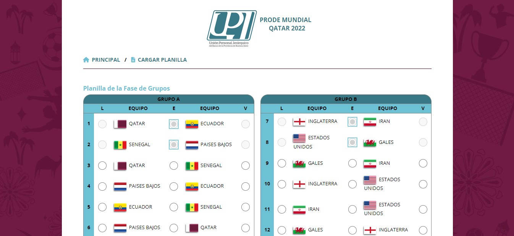

# Prode Mundial Qatar 2022

Proyecto de sitio web de Prode del Mundial Qatar 2022 para Unión Personal Jerárquico del Banco de la Provincia de Buenos Aires.


## Screenshot 📷




## Comenzando 🚀

### Pre-requisitos 📋

Editar el array **$users** en *admin/users.php*, con los usuarios habilitados para administrar el sitio


```
$users = [
    "user1" => "password1",
    "user2" => "password2",
    "user3" => "password3",
];
```

Editar las constantes **DB_SERVER, DB_USER, DB_PASS, DB_NAME** en *Classes/db_connection.php*, con los datos de conexión a la base de datos MySQL

```
define("DB_SERVER", "");
define("DB_USER", "");
define("DB_PASS", "");
define("DB_NAME", "");
```


## Construido con 🛠️

* [HTML](https://developer.mozilla.org/es/docs/Web/HTML)
* [CSS](https://developer.mozilla.org/es/docs/Web/CSS)
* [JavaScript](https://developer.mozilla.org/es/docs/Learn/JavaScript)
* [PHP](https://www.php.net/)
* [MySQL](https://www.mysql.com/)
* [FPDF](http://www.fpdf.org/) - Clase PHP que permite generar documentos PDF


## Autor ✒️

* **Luciano Rodríguez** - [luckidetrenque](https://github.com/luckidetrenque)

## Licencia 📄

Este proyecto está bajo la Licencia (GPL-3.0) - mira el archivo [LICENSE.md](LICENSE.md) para detalles
